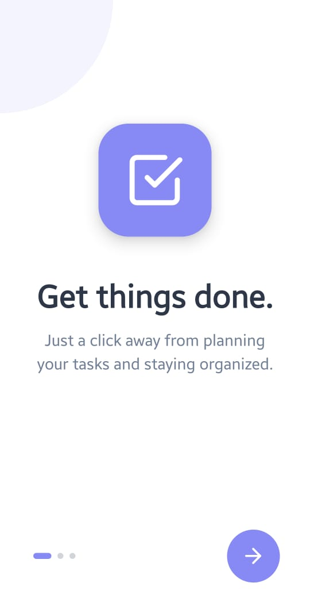
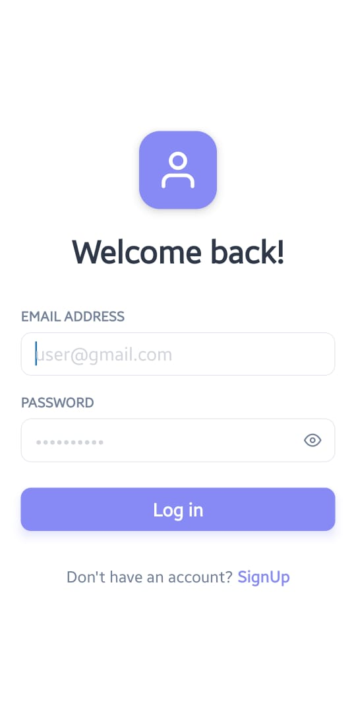
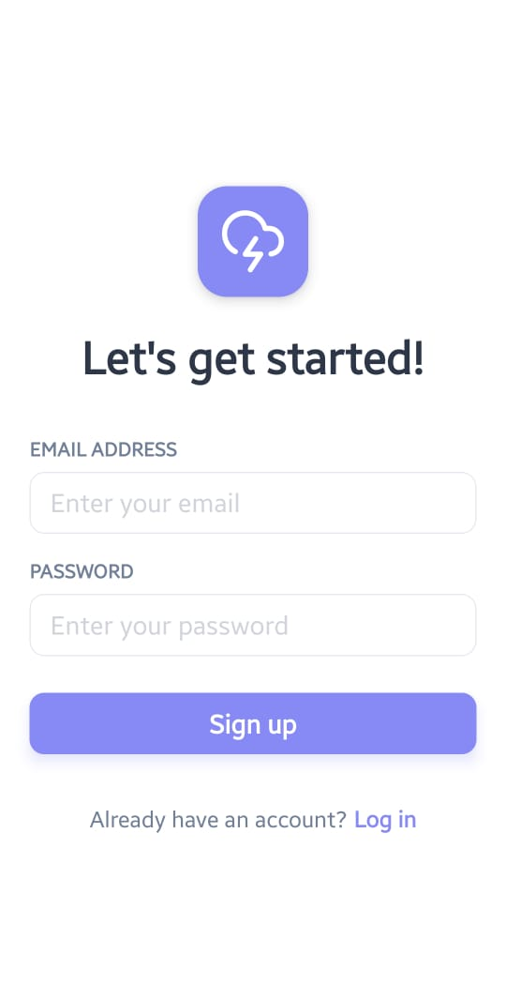
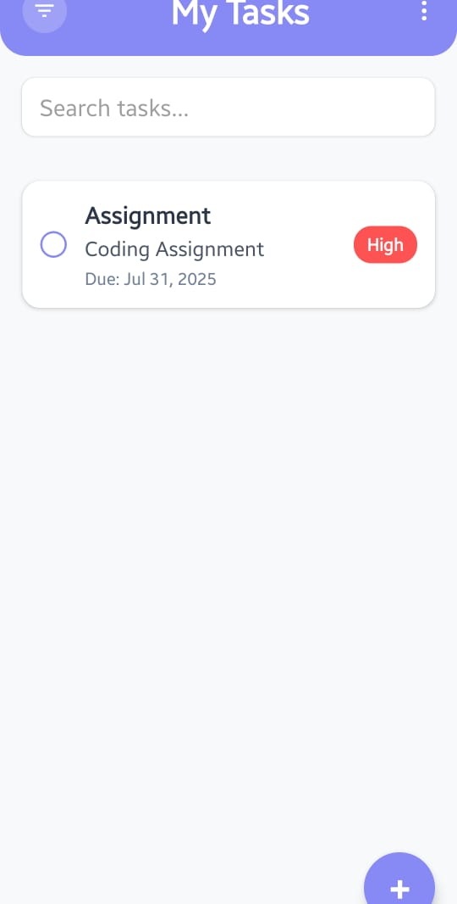
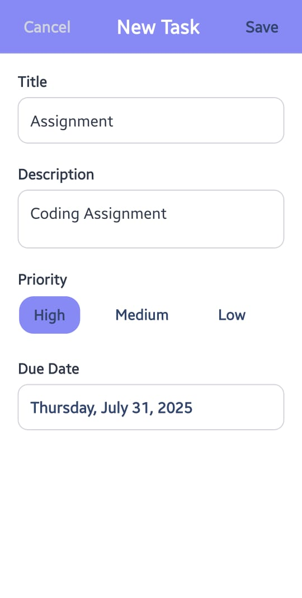
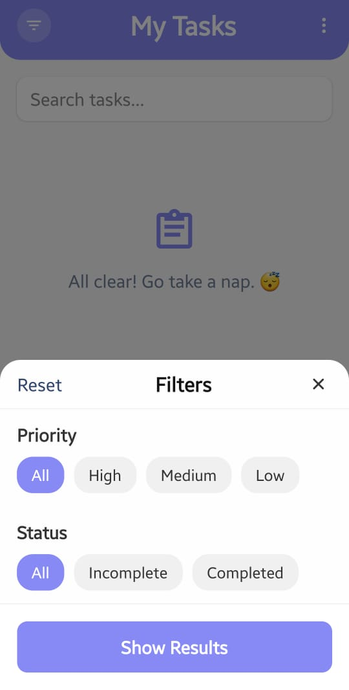

# 🗂️ Task Management App

A clean and simple mobile app to help you stay organized and manage your daily tasks — built using React Native, Expo, and TypeScript, with Firebase handling all the backend magic.

This app was created to showcase modern mobile development skills with a smooth user interface, strong functionality, and good code structure.

## 📱 App Preview

Here’s a quick look at the app screens, designed using Material Design for a clean and intuitive feel:

| Onboarding | Login | SignUp |
|------------|-------|--------|
|  |  |  |

| Dashboard | Add | Filter |
|-----------|-----|--------|
|  |  |  |

---

## 📦 Download the App

You can try the app directly on your Android device:

[**⬇️ Download Task Management App (.apk)**](./assets/git-readme/Task%20Management.apk)

---

## ✨ Key Features

### 🔐 Authentication
- Register and log in securely using email & password (Firebase Auth)
- Friendly error messages if something goes wrong

### ✅ Manage Your Tasks
- Add new tasks with title, description, due date & priority
- View your task list in a scrollable layout
- Edit any task details
- Delete tasks you no longer need
- Mark as done with a simple tap

### ⚙️ Smart Features
- Filter tasks by priority (Low, Medium, High) and status (Completed/Incomplete)
- Sort automatically by due date

### 🎨 UI & UX
- Follows Material Design for a clean, modern look
- Works great on both iOS and Android
- Easy and smooth navigation between screens

## 🔧 Tech Stack
- **Frontend**: React Native + Expo + TypeScript
- **Backend**: Firebase (Auth + Firestore)
- **Navigation**: Expo Router
- **State Management**: React Context + Hooks
- **Date Handling**: date-fns for formatting & comparisons

## 🚀 Getting Started

### ✅ What You’ll Need
- Node.js (use the LTS version)
- npm or yarn
- Expo Go app on your phone (iOS/Android)
- Expo CLI (install globally):

```bash
npm install -g expo-cli
```

### 💻 Setup Instructions

#### 🔁 Clone the Project
```bash
git clone https://github.com/asmit-rai/Task-Management-App.git
cd Task-Management-App
```

#### 📦 Install Dependencies
```bash
npm install
```
#### ▶️ Run the App
```bash
npx expo start
```

Scan the QR code using the Expo Go app to open the app on your device.
